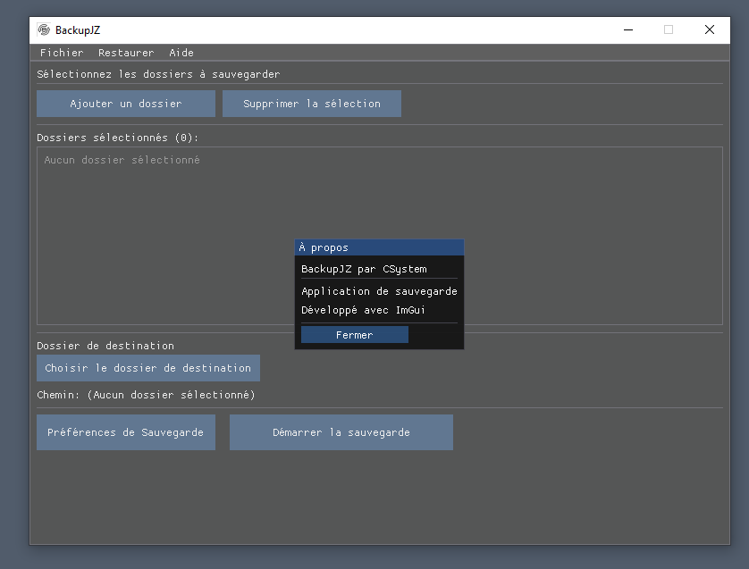

# BackupJZ



**BackupJZ** is a backup application developed in C++ with an intuitive graphical interface. It allows you to backup, compress, encrypt, and restore your files and folders in a secure and automated manner.

**Warning**: The encryption system may be detected as a virus (XOR encryption).

## Table of Contents

- [Features](#-features)
- [Libraries Used](#-libraries-used)
- [Installation](#-installation)
- [Compilation](#-compilation)
- [Usage](#-usage)
- [Project Structure](#-project-structure)
- [Author](#-author)

## Features

### Backup
- **Multiple backup**: Select multiple folders to backup simultaneously
- **Automatic compression**: Compress backups in ZIP format to save disk space
- **Automatic backup**: Schedule automatic backups at regular intervals (configurable in hours)
- **Version management**: Keep a configurable number of backups with automatic deletion of old versions

### Security
- **Optional encryption**: Encrypt backups with a custom key
- **Secure format**: Encrypted backups use the `.jz` extension for easy identification
- **Data protection**: XOR encryption combined with Base64 encoding for enhanced security

### Restoration
- **Complete restoration**: Restore complete or selective backups
- **Automatic detection**: Automatically detect encrypted backups with key request
- **Intuitive interface**: List of available backups with easy selection

### User Interface
- **Modern interface**: Graphical interface developed with ImGui offering a smooth user experience
- **Multilingual**: Support for French and English with real-time language switching
- **Progress bar**: Real-time tracking of backup and restoration progress
- **System notifications**: Windows notifications for important operations
- **System tray minimization**: The application can run in the background with an icon in the notification area

### Preferences and Configuration
- **Backup preferences**:
  - Enable/disable automatic backup
  - Automatic backup interval (in hours)
  - Automatic compression
  - Encryption with custom key
  - Maximum number of backups to keep
  - Automatic deletion of old backups
  - Display notifications
  
- **Application settings**:
  - Language selection (French/English)
  - Automatic configuration saving

### Tracking and Monitoring
- **Detailed progress**: Display of global and per-file progress
- **Real-time status**: Detailed status messages during operations
- **History**: Tracking of the last backups performed

## Libraries Used

### Graphical Interface
- **ImGui**: Immediate mode GUI library for C++
  - Backend: ImGui Win32 + OpenGL3
  - Version: Latest stable version
  - Usage: Complete graphical interface, widgets, menus, popups

### Compression
- **libzip**: Library for creating and manipulating ZIP archives
  - Supported compression formats: Standard ZIP
  - Usage: Compression and decompression of backups

### Compression Algorithms
- **zlib**: Lossless compression (deflate)
- **bzip2 (bz2)**: Compression with better ratio
- **LZMA**: Compression with high ratio
- **Zstandard (zstd)**: Fast and efficient compression

### Graphics and Rendering
- **OpenGL**: Graphics API for interface rendering
  - Version: OpenGL 3.x
  - Usage: Rendering of ImGui interface

### Windows System
- **Win32 API**: Native Windows API
  - Functions: Window management, dialog boxes, system notifications
  - Shell32: Folder selection
  - GDI+: Icon and image management

### C++ Standard
- **C++17**: Modern C++ standard
  - Usage: Threads, atomics, mutex for asynchronous operations
  - STL: Vectors, strings, algorithms

## Installation

### Prerequisites
- **Windows 10** or higher
- **Visual Studio 2019** or higher (with toolset v143)
- **CMake** (to compile libzip if necessary)
- **vcpkg** (optional, for dependency management)

### Included Dependencies
The project already includes the necessary libraries in the `Libs/` folder:
- `Libs/imGui/`: Complete ImGui library
- `Libs/libzip/`: libzip library
- `Libs/x64-windows/`: Compiled libraries (lib, dll, headers)

## Compilation

### With Visual Studio

1. **Open the project**:
   ```
   Open BackupJZ.sln in Visual Studio
   ```

2. **Configure the platform**:
   - Select `x64` as the target platform
   - Choose `Debug` or `Release` according to your needs

3. **Compile**:
   - Menu: `Build` > `Build Solution` (or `Ctrl+Shift+B`)
   - The executable will be generated in `Debug/` or `Release/`

### Project Configuration

The `BackupJZ.vcxproj` file contains all necessary configurations:
- **Include directories**:
  - `.\Libs\imGui`
  - `.\Libs\imGui\backends`
  - `.\Libs\libzip\lib`

- **Library directories**:
  - `.\Libs\libzip\lib`
  - `.\Libs\x64-windows\lib`

- **Linked libraries**:
  - `opengl32.lib`
  - `zip.lib`
  - `zlib.lib`
  - `bz2.lib`
  - `lzma.lib`
  - `zstd.lib`

- **C++ Standard**: C++17

## Usage

### First Use

1. **Launch the application**: Run `BackupJZ.exe`

2. **Select folders**:
   - Click on "Add a folder"
   - Select the folders to backup
   - Selected folders appear in the list

3. **Choose destination**:
   - Click on "Choose destination folder"
   - Select where to save backups

4. **Configure preferences** (optional):
   - Click on "Backup Preferences"
   - Configure options according to your needs:
     - Automatic backup
     - Compression
     - Encryption
     - Maximum number of backups

5. **Start backup**:
   - Click on "Start backup"
   - Follow the progress in the interface

### Restoring a Backup

1. **Open the Restore menu**:
   - Menu: `Restore` > `Restore a backup`

2. **Select a backup**:
   - Click on "Refresh" to list available backups
   - Select the backup to restore

3. **Choose restoration folder**:
   - Enter the path or use "Browse"
   - For encrypted backups, the key will be requested automatically

4. **Launch restoration**:
   - Click on "Restore"
   - Follow the progress

### Automatic Backup

1. **Enable automatic backup**:
   - Menu: `File` > `Backup Preferences`
   - Check "Automatic backup"
   - Set the interval in hours

2. **The application checks automatically**:
   - The application periodically checks if a backup is necessary
   - Automatic backups run in the background
   - Notifications are displayed (if enabled)

## Project Structure

```
BackupJZ/
├── Demo/
│   └── BackupJZ.png          # Demonstration screenshot
├── Libs/
│   ├── imGui/                # ImGui library
│   │   ├── backends/         # ImGui backends (Win32, OpenGL3)
│   │   └── ...
│   ├── libzip/               # libzip library
│   │   ├── lib/              # libzip headers and sources
│   │   └── ...
│   └── x64-windows/          # Compiled libraries
│       ├── bin/              # DLLs
│       ├── include/          # Headers
│       └── lib/              # Static libraries
├── main.cpp                  # Main entry point
├── window.cpp/h              # Windows window management
├── backup.cpp/h              # Backup logic
├── backup_tracking.cpp/h     # Backup tracking
├── encryption.cpp/h          # Encryption/decryption
├── config.cpp/h              # Configuration management
├── preferences.cpp/h         # Preferences management
├── file_utils.cpp/h          # File utilities
├── translation.cpp/h         # Translation system
├── logo_embedded.h           # Embedded logo
├── app_icon.ico              # Application icon
├── app_icon.rc               # Icon resource
├── BackupJZ.sln              # Visual Studio solution
├── BackupJZ.vcxproj          # Visual Studio project
└── README.md                 # This file
```

### Main Modules

- **main.cpp**: Entry point, main loop, ImGui interface management
- **window.cpp/h**: Windows window creation and management, system icon, notifications
- **backup.cpp/h**: Backup functions, compression, restoration
- **encryption.cpp/h**: XOR + Base64 encryption, key management
- **config.cpp/h**: Configuration save/load (folders, destination)
- **preferences.cpp/h**: User preferences management (auto-backup, compression, etc.)
- **file_utils.cpp/h**: Utilities for file and folder manipulation
- **backup_tracking.cpp/h**: Backup tracking and management (list, delete old ones)
- **translation.cpp/h**: French/English translation system

## Advanced Features

### Encryption
- **Algorithm**: XOR encryption with custom key + Base64 encoding
- **Format**: Encrypted files use the `.jz` extension
- **Security**: The key is stored securely in preferences

### Compression
- **Format**: Standard ZIP compatible with all decompressors
- **Supported algorithms**: zlib, bzip2, LZMA, Zstandard
- **Efficiency**: Optimal compression to reduce backup size

### Automatic Backup
- **Periodic checking**: The application automatically checks if a backup is necessary
- **Background execution**: Automatic backups do not block the interface
- **Notifications**: System notifications for successes and errors

### Version Management
- **Configurable retention**: Maximum number of backups to keep
- **Automatic deletion**: Deletion of old backups when the limit is reached
- **Naming**: Backups are named with date and time

## Troubleshooting

### Application won't start
- Check that all DLLs are present in the executable folder
- Check that libraries are correctly linked

### Compression error
- Check that the destination folder has enough space
- Check write permissions on the destination folder

### Restoration error
- Check that the backup is not corrupted
- For encrypted backups, check that the key is correct
- Check that the restoration folder exists and is writable

## Author

**BackupJZ** by **CSystem**

Developed with ImGui and the open-source libraries mentioned above.

## License

This project uses several open-source libraries:
- **ImGui**: MIT License
- **libzip**: BSD License
- **zlib**: zlib License
- **bzip2**: BSD License
- **LZMA**: Public Domain
- **Zstandard**: BSD License

---
